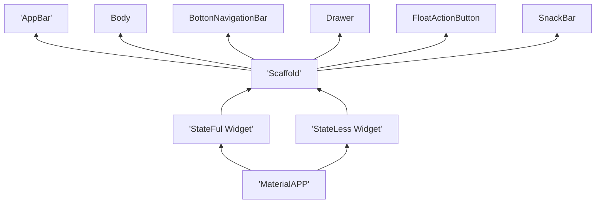

#AULA DO DIA 27/01

Na aula de hoje, começamos instalando o Git no computador e, em seguida, realizamos a integração do Git com o GitHub, possibilitando o controle e o armazenamento dos projetos online. Utilizamos o Git Bash para executar comandos diretamente no terminal, incluindo comandos para criar pastas de forma prática, sem precisar usar o explorador de arquivos.

Também configuramos o Git usando o comando git config --global, que serve para definir configurações globais do Git no computador, ou seja, essas configurações passam a valer para todos os projetos do usuário. Dentro dessa configuração, utilizamos user.email para informar o e-mail cadastrado no GitHub e user.name para definir o nome de usuário do GitHub, garantindo que todas as alterações feitas nos projetos fiquem corretamente identificadas.

Após isso, instalamos o Visual Studio Code (VS Code) e o conectamos ao GitHub, facilitando o desenvolvimento dos projetos. Por fim, utilizamos a extensão Live Server, que permitiu acompanhar em tempo real as atividades realizadas pelo professor diretamente em nosso computador, tornando o processo de aprendizado mais claro e eficiente.

----------------------------------------------------------------------------------------------

## Introdução ao Desenvolvimento Mobile

### Tipos de Desenvolvimento
- Nativo
    - Android:
        - SDK: Android SDK
        - IDE: Android Studio
        - Linguagens: Kotlin e Java
        - Ambientes: Mac, Win, Linux

    - Ios:
        - SDK: Cocoa Touch
        - IDE: Xcode
        - Linguagens: Swift / Objectype-C
        - Ambientes: Mac

- Multiplataforma
    - React Native:
        - SDK: Node.JS
        - IDE: VSCode
        - Linguagens: JavaScripit / TypeScripit
        - Ambiente: Mac, Win, Linux

    - Flutter:
        - SDK: Flutter SDK
        - IDE: VSCode, Android Studio
        - Linguagens: Dart
        - Ambientes: Mac, Win, Linux

## Preparação do ambiente de desenvolvimento

## Instalação Flutter SDK
- download do arquivo ZIP na página flutter.dev
- inclusão do flutter na pasta C:\src
- inclusão do flutter\bin nas variáveis de ambiente
- teste o flutter --version

### Instalação do AndroidSDK
- download do Android SDK - Command Line Tools
- adicionar o Command-line ao c:\src\AndroidSDK
- adicionar o SDKManager as Variáveis de Ambiente
- download doa pacotes
    - emulador
    - platforms
    - platforms-tools
    - build-tools
- adicionar ADB e o Emulator as Varíaveis de Ambiente
- Criação da imagem do Emulador - via sdkmanager
- Build do Emulador - via sdkmanager

### Criação de Projetos e Códigos da Linha de Comando

- criação de projetos
    - flutter create nome_do_app
        - flags(parâmetros):
            - --empty : Cria um aplicativo "vazio"(hello World!)
            - --platforms : permite a seleção de uma plataforma de desenvolvimento
                - ex: --platforms=android (a criação do projeto será somente para a plataforma android)
    - exemplo de criação de uma aplicativo android vazio
        - flutter create nome_do_app --empty --platforms=android
        - obs: nome do aplicativo: todas as letras minúsculas, separação de palavras com "_";
    - flutter doctor
        - permite correção de pequenos problemas no flutter e identificação dos parâmetros funcionais em relação as plataforma de desenvolvimento
        - sempre rodar o flutter doctor no começo do desenvolvimento
    - flutter clean
        - limpa cache do build(apaga o apk anterior)
    - flutter run -v 
        - build do app (apk)
    
- gerenciamento de dependencias do PubSpec()
    - instalação
        - flutter pub add nome_dependencia
    - baixar e instalar dependencias projetadas
        - flutter pub get
    - outros comandos do flutter pub(dependencias)
        - flutter pub outdated (verifica se as dependências estão desatualizadas)
        - flutter pub upgrade (atualiza as dependências do flutter pub)

### Estrutura de um Aplicativo

#### A Hierarquia de Árvore

Gráfico com demonstração da hierarquia

### Matriz Comparativa entre StateLess e StateFul

|Característica|Stateless Widget|Stateful Widget|
|-|-|-|
|Mutabilidade|Imutável(Não Muda após Carregar)| Mutável(Permite Mudanças de Estado após Carregamento do Aplciativo)|
|Uso Ideal| Layouts fixo e exibição de dados estáticos

# Gerenciador de tarefas com Dashboard
Especificações dos Requisitos de Software (SRE)

Documentação Baseada na ISO/IEEE/IEC 29148:2018

## 1. Identificação do Projeto

Projeto: Gerenciador de Tarefas com Dashboard

Versão: 1.0.0
primeiro número (1): modificação do tipo Major (modificações grande de estrutura)
sefundo número (0): modificação do tipo Minor 
(adição de novas funcionalidades, modificações menores)
terceiro número (0): modificação do tipo Patch
(correções e mudanças menores(fonte, cores, tamanhos))

Data: 2026-04-23

## 2. Introdução

### 2.1 Propósito

Descrever os requistos do projeto "GTD", aplicação mobile desenvolvida em flutter com uso de **Provider** e estrutura **MVC**

### 2.2 Escopo

O Sistema Permitirá:

- Cadastrar Tarefas;
- visualizar a lista de tarefas;
- alterar o status da tarefa
- remover tarefas concluídas
- visuakizar indicadores conslidados em um dashboard

Conceito do Projeto:

- Modelagem de Dados;
- Separação entre interface e regras de negócio (MVC);
- Gerenciamento de Estado com Provider

### 2.3 Acrônimos e Siglas

- **GTD**: Gerenciamento de Tarefas com Dashboard

### 2.4 Visão Geral

Este Docuemtno apresenta a descrição geral do sistema, os requisitos funcionais e não-funcionais e regras de negócio

## 3. Requsitos

### 3.1 Requsitos Funcionais

| ID | Requisito | Descrição |
|---|---|---|
| RF-001 | Criar Tarefa | O sistema deve permitir que o usuário crie uma nova tarefa com título, descrição e data de vencimento |
| RF-002 | Listar Tarefas | O sistema deve exibir todas as tarefas cadastradas em formato de lista |
| RF-003 | Atualizar Status | O sistema deve permitir alterar o status da tarefa (pendente, em progresso, concluída) |
| RF-004 | Deletar Tarefa | O sistema deve permitir remover tarefas concluídas do sistema |
| RF-005 | Filtrar Tarefas | O sistema deve permitir filtrar tarefas por status e data de vencimento |
| RF-006 | Dashboard de Indicadores | O sistema deve exibir um dashboard com estatísticas consolidadas (total de tarefas, tarefas concluídas, tarefas pendentes) |
| RF-007 | Persistência de Dados | O sistema deve manter os dados de tarefas armazenados localmente no dispositivo |
| RF-008 | Editar Tarefa | O sistema deve permitir que o usuário modifique os dados de uma tarefa existente |

### 3.2 Requsitos Não-Funcionais

## 4. Regras do Negócio